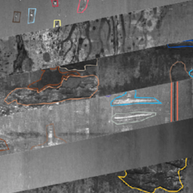
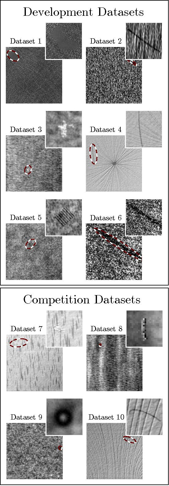

# metal-defect-datasets
A collection of public datasets for surface metal defects detection task. Source, and roboflow (ready to use) links are included.

## Datasets
Two links are provided below, one is for citation and the roboflow is to download the dataset ready for training with COCO format annotation. 
In the roboflow, we split all the datasets into train/valid/test, with 70%, 20%, and 10% respectively.
Further, some of the datasets are not available on the roboflow website due to the limitation in the upload. However, the dataset is still available from the source link.
| Dataset                       | Citation                                                  |   roboflow                                                                        |   Source      |
| -------------------------     | --------------------------------------------------------- | --------------------------------------------------------------------------------- | ---------     |
| NEU-DET                       | [Cite](https://doi.org/10.1016/j.apsusc.2013.09.002)      | [Download](https://universe.roboflow.com/defectdatasets/neu-det-fquva/1)          |[Source](https://www.kaggle.com/datasets/kaustubhdikshit/neu-surface-defect-database) |
| kolektorSDD1                  | [Cite](https://doi.org/10.1016/j.compind.2021.103459)     | NA                                                                                | [Source](https://www.vicos.si/resources/kolektorsdd/) | 
| kolektorSDD2                  | [Cite](https://doi.org/10.1016/j.compind.2021.103459)     | [Download](https://universe.roboflow.com/defectdatasets/kolektorsdd2-xnm8r/2)     | [Source](https://www.vicos.si/resources/kolektorsdd2/) |
| Magnetic-tile-defect(MTD)     | [Cite](https://doi.org/10.1007/s00371-018-1588-5)         | [Download](https://universe.roboflow.com/defectdatasets/magnatic-tile-defect/1)   | [Source](https://github.com/Charmve/Surface-Defect-Detection/tree/master/Magnetic-Tile-Defect) |
| NRSD-CR                       | [Cite](https://doi.org/10.1109/TIM.2020.3040890)          | [Download](https://universe.roboflow.com/defectdatasets/nrsd-cr/1)                | [Source](https://github.com/zdfcvsn/MCnet) |
| GC10-DET                      | [Cite](https://doi.org/10.3390/s20061562)                 | [Download](https://universe.roboflow.com/g-deepti-raj/gc10-det-latest/dataset/3)  | [Source](https://www.kaggle.com/datasets/alex000kim/gc10det?select=Defects+Description.xlsx) |
| DAGM 2007                     | NA                                                        | NA                                                                                | [Source](https://hci.iwr.uni-heidelberg.de/content/weakly-supervised-learning-industrial-optical-inspection) |
| Severstal                     | NA                                                        | NA                                                                                | [Source](https://www.kaggle.com/competitions/severstal-steel-defect-detection/data) |
| RSDDs                         | [Cite](https://doi.org/10.1109/JSEN.2017.2761858)         | NA                                                                                | [Source](https://pan.baidu.com/s/1svsnqL0r1kasVDNjppkEwg#list/path=%2F) |
| BSData                        | [Cite](https://doi.org/10.5445/IR/1000133819)             | NA                                                                                | [Source](https://github.com/2Obe/BSData) |

## Notes:
- Some of the datasets are annotated using png masks, however we converted masks to json coco data format using [this](https://github.com/brunobelloni/binary-to-coco-json-converter/) repo and the converted annotation list is inside the support folder.
    - Kolektorsdd2
    - MTD
    - NRSD-CR
- For GC10-DET dataset, classes naming needs to be corrected when downlowding from the roboflow link.
- For RSDDs dataset, source link might require PASSCODE which is **"nanr"**

## Datasets Samples:
- **NEU-DET**:                           
- **KolektorSDD1**:                
- **KolektorSDD2**:                
- **Magnetic-tile-defect**:                  
- **NRSD-CR**:                           
- **GC10-DET**:                         
- **Severstal**:                       
- **DAGM 2007**:                        
- **RSDDs**:                          
- **BSData**:                             

**keywords**: defect-dataset, yolov7, neu-det, kolektorsdd, magnetic-tile-defect, nrsd-cr, gc10-det, dagm2007, severstal, rsdds, bsdata
